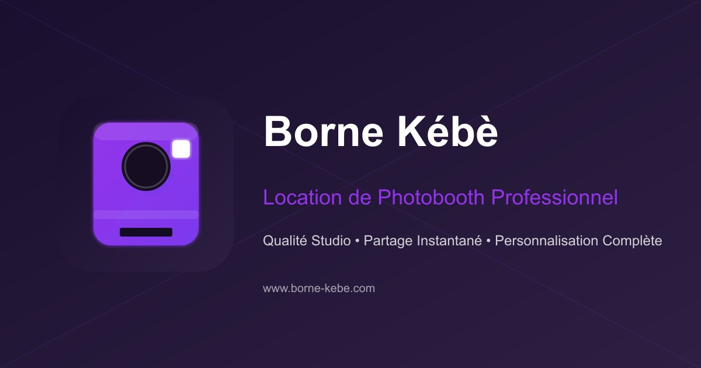

---

# Borne Kébè - Photobooth Professionnel

Borne Kébè est une plateforme moderne dédiée à la location de photobooths haut de gamme pour des événements professionnels et privés. Notre solution allie technologie de pointe et design élégant pour offrir une expérience photo unique.

## 🚀 Démarrage Rapide

1. **Cloner le dépôt**  
   ```bash
   git clone https://github.com/e-jaafar/borne-kebe
   ```

2. **Installer les dépendances**  
   ```bash
   npm install
   ```

3. **Lancer en mode développement**  
   ```bash
   npm run dev
   ```

4. **Build pour production**  
   ```bash
   npm run build
   ```

5. **Lancer en mode production**  
   ```bash
   npm start
   ```

## 🌐 Structure du Projet

```
├── app/           # Pages et routes Next.js
├── components/    # Composants React réutilisables
├── public/        # Assets statiques
├── styles/        # Styles globaux
├── lib/           # Utilitaires et helpers
├── types/         # Types TypeScript
└── translations/  # Fichiers de traduction
```

## 📱 Fonctionnalités Principales

- **Galerie Interactive** - Présentation dynamique des photos d'événements
- **Réservation Intuitive** - Processus de réservation simplifié
- **Contact Direct** - Formulaire de contact avec upload de fichiers
- **Tarification Claire** - Présentation des différentes formules
- **Blog & Actualités** - Contenu régulièrement mis à jour
- **Responsive Design** - Adaptation parfaite sur tous les appareils

## 🔒 Variables d'Environnement

Créer un fichier `.env` à la racine du projet et y inclure :

```
RESEND_API_KEY=votre_clé_api
```

## 🎯 À propos

- 🌍 **Multilingue** (FR/EN/NL)
- 🎨 **Design moderne** et responsive
- 🚀 **Performance optimisée**
- 🔒 **Sécurité renforcée**
- 🎯 **SEO optimisé**

## 🛠 Technologies Utilisées

- **Frontend** : Next.js 14, React, TypeScript, TailwindCSS, Framer Motion, Shadcn/ui
- **Backend** : API Routes Next.js, Resend (email)
- **Performance** : Images optimisées, lazy loading, code splitting
- **Sécurité** : Headers de sécurité, protection CSRF, validation des données

## ✨ License

Ce projet est sous licence MIT - voir le fichier [LICENSE.md](LICENSE.md) pour plus de détails.

## 👥 Contact

- **Site Web** : [www.borne-kebe.com](https://www.borne-kebe.com)
- **Email** : alchimistelab@hotmail.com
- **LinkedIn** : [Jaafar El](https://www.linkedin.com/in/jaafar-el/)

---

Développé avec ❤️ par [Jaafar El](https://www.linkedin.com/in/jaafar-el/)


--- 

Les contributions sont les bienvenues ! Ouvrez une issue ou soumettez une pull request pour contribuer.
